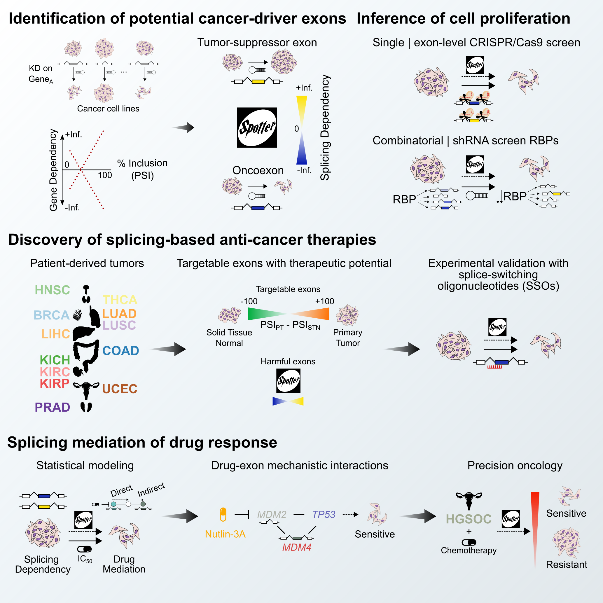

# *In silico* RNA isoform screening illuminates the unexplored splicing vulnerabilities driving cancer

This is the repository to reproduce the analysis carried out in our manuscript, from the data download to the figures.

The article describes how we repurposed gene-level knockdown screens across many cancer cell lines and their intrinsic heterogeneity to generate a computational framework called `spotter` of cancer-driver exons whose inclusion is highly predictive of cancer cell proliferation.

## Overview
The were made available as part of a Python package called [target_spotter](https://github.com/MiqG/target_spotter) and can also be accessed interactively at https://spotter.crg.eu.

## Structure
- `images` contains images for the repository.
- `support` contains a set of tables and files essential to run all workflows that are either handmade or had to be downloaded manually.
- `workflows`
    1. `obtain_data` generates the `data/raw` directory. Note that some raw datasets require special permissions and/or need to be downloaded manually. See the corresponding `workflows/obtain_data/README.md` file.
    2. `preprocess_data` generates the `data/prep` directory cleaning raw datasets to be analyzed.
    3. `model_splicing_dependency` generates the `results/model_splicing_dependency` directory. Perfoms model fitting and validation using existing datasets.
    4. `streamlined_therapy_dev` generates the `results/streamlined_therapy_dev` directory. Prioritizes cancer-driver exons with therapeutic potential from patient data.
    5. `experimental_validation` generates the `results/experimental_validation` directory. Analyzes our inhouse experimental results.
    6. `exon_drug_interactions` generates the `results/exon_drug_interactions` directory. Performs drug-exon association models using predicted splicing dependencies for cancer cell lines and explores how cancer-driver exons may mediate drug mechanism of action.
    7. `treatment_recommendation` generates the `results/treatment_recommendation` directory. Case study of a dataset in which ~40 patients were treated with chemotherapies and we try to predict their outcomes with our statistical models.
    8. `prepare_submission` generates the `results/prepare_submission` directory. Collects tables from all workflows and puts them in order to prepare the submission.
    
After running all workflows (indicated below), the figures used in the manuscript and their accompaining data will be in the subdirectory `results/*/figures`.    

## Requirements
- command-line tools
    - conda==23.3.1
    - snakemake==6.10.0
    - vast-tools==2.5.1
    - csvkit==1.0.5
    - fastq-dump==2.9.1
    - gdc-client==1.6.1
    - ascp==4.1.1.73
    - axel==2.17.10
    
- Python==3.8.3
    - joblib==1.1.0
    - tqdm==4.65.0
    - pandas==1.3.0
    - networkx==2.8.4
    - numpy==1.20.3

- R==4.1.0
    - cluster==2.1.2
    - clusterProfiler==4.0.5
    - ComplexHeatmap==2.9.3
    - cowplot==1.1.1
    - extrafont==0.17
    - ggnewscale==0.4.5
    - ggplotify==0.1.0
    - ggpubr==0.4.0
    - ggraph==2.0.5
    - ggrepel==0.9.1
    - ggtext==0.1.1
    - graphlayouts==0.8.0
    - gridExtra==2.3
    - gtools==3.9.2
    - here==1.0.1
    - igraph==1.3.1
    - optparse==1.7.1
    - pROC==1.18.0
    - readxl==1.3.1
    - scattermore==0.7
    - statebins==2.0.0
    - SummarizedExperiment==1.22.0
    - TCGAbiolinks==2.25.3
    - tidytext==0.3.2
    - tidyverse==1.3.1

## Usage
Refer to each `workflow/*/README.md` file to run each workflow. Note that `obtain_data` and `preprocess_data` are the most computationally demanding workflows. 